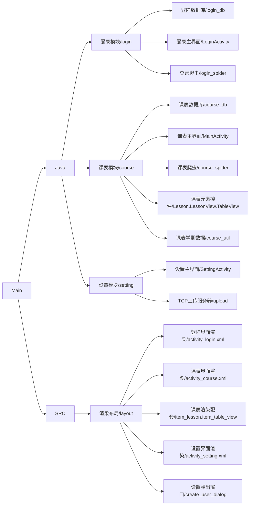
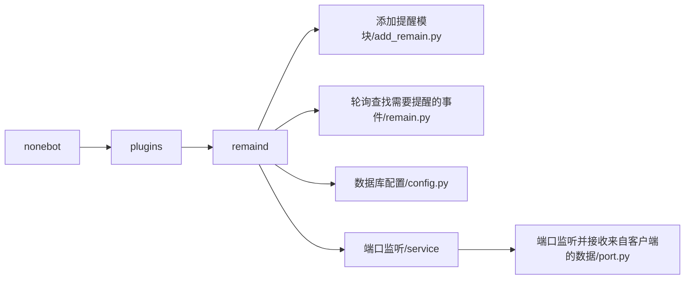

### 中国石油大学专用课表

#### 综述

代码分为客户端和服务端两部分，客户端为Java开发的安卓app，项目地址为https://github.com/WCX1024979076/upc_course_schedule；服务端为python开发的qq机器人，项目地址为https://github.com/WCX1024979076/upc_course_schedule_service

#### 客户端代码注解

##### 代码结构图

##### 参考于：

[课表提醒app](https://blog.csdn.net/ns_code/article/details/11269957?utm_medium=distribute.pc_relevant.none-task-blog-baidujs_title-3&spm=1001.2101.3001.4242)

[界面跳转](https://blog.csdn.net/matken/article/details/105820665)

[课表ui](https://www.wanandroid.com/blog/show/2117)

[U课表](https://github.com/Wangs121/UPC_Schedule)

#### 服务端代码注解

##### 服务端代码结构图

注：这里进展示课表提醒模块，其余请参照https://github.com/beiyuouo/plugins-for-nonebot2

